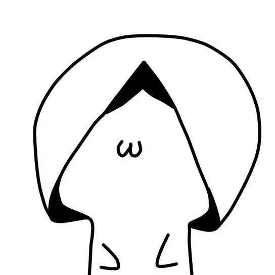
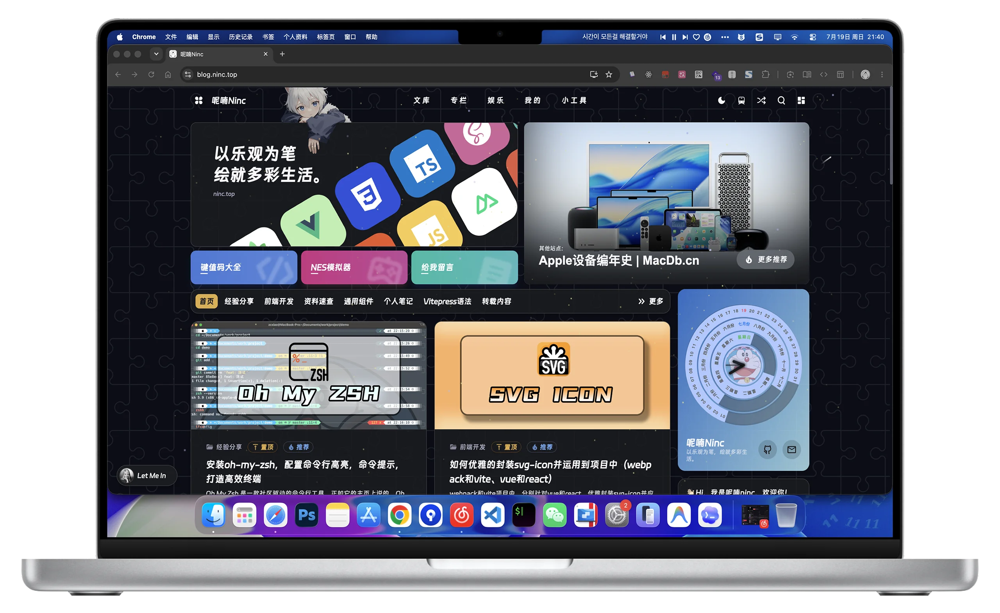
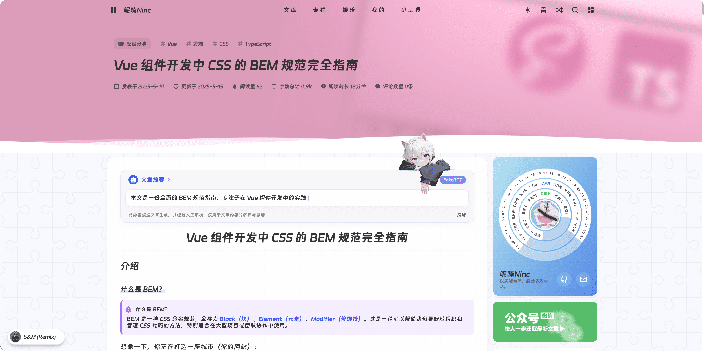
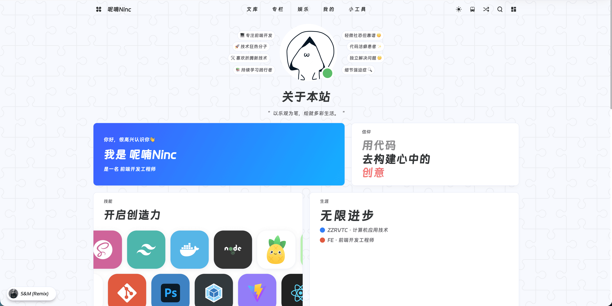
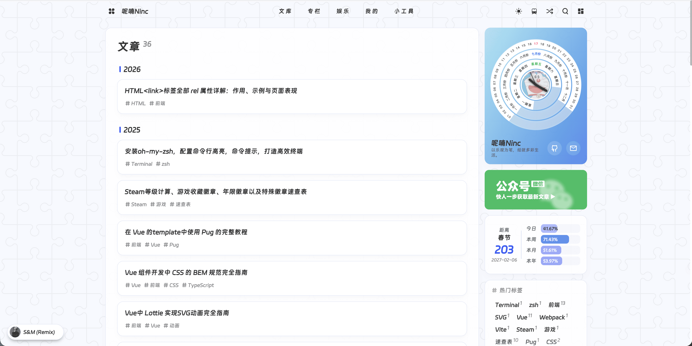
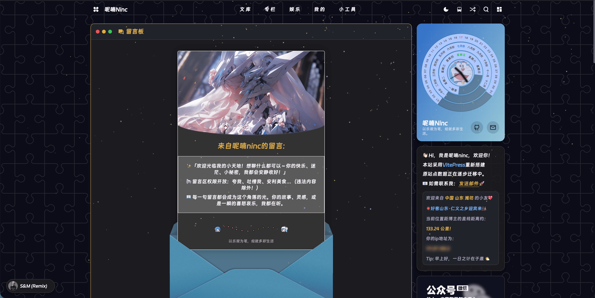
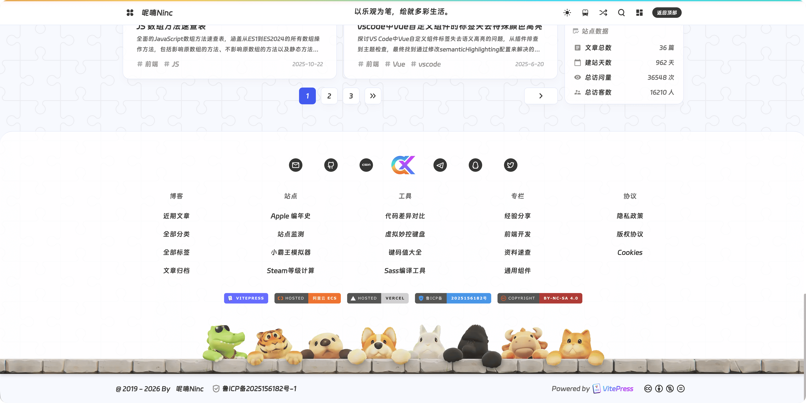
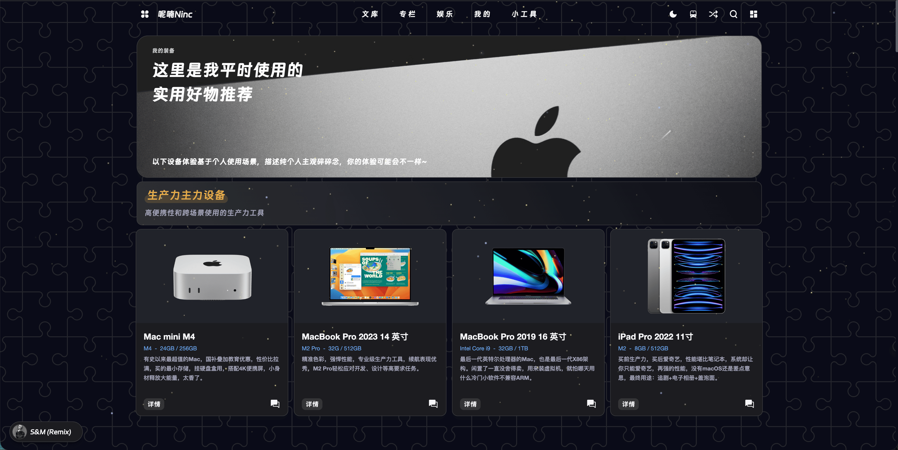

<p align="center">
  
</p>

<h1 align="center">vitepress-theme-ninc</h1>

<p align="center">
  一个不想当博客的主题不是好 VitePress 主题
</p>

<p align="center">
  <a href="https://www.npmjs.com/package/vitepress-theme-ninc" target="_blank"></a>
  <a href="https://www.npmjs.com/package/vitepress-theme-ninc" target="_blank"></a>
  <a href="https://github.com/zhChuXiao/vitepress-theme-ninc/blob/master/LICENSE" target="_blank"></a>
  <a href="https://github.com/zhChuXiao/vitepress-theme-ninc/stargazers" target="_blank"></a>
  <a href="https://github.com/zhChuXiao/vitepress-theme-ninc/network/members" target="_blank"></a>
  <a href="https://github.com/zhChuXiao/vitepress-theme-ninc/issues" target="_blank"></a>
  <a href="https://github.com/zhChuXiao/vitepress-theme-ninc/pulls" target="_blank"></a>
  <a href="https://github.com/zhChuXiao/vitepress-theme-ninc/commits/master" target="_blank"></a>
  <a href="https://github.com/zhChuXiao/vitepress-theme-ninc/releases" target="_blank"></a>
  <a href="https://github.com/zhChuXiao/vitepress-theme-ninc/blob/master/package.json" target="_blank"></a>
</p>

<p align="center">
  <a href="https://theme.ninc.top">使用文档</a> ·
  <a href="https://blog.ninc.top">在线演示</a> ·
  <a href="https://github.com/zhChuXiao/vitepress-theme-ninc/issues">问题反馈</a> ·
  <a href="CHANGELOG.md">更新日志</a>
</p>

<p align="center">
  
  
  
  
  
  
  
  
  
</p>

---

<p align="center">
  
  
</p>

## 为什么造这个轮子

用 VitePress 搭博客的人不少，但默认主题太素了。市面上的主题要么功能残缺，要么改起来费劲。我想要的是一个**装上就能用、不用折腾插件**的主题——评论、搜索、音乐、PWA、灯箱、RSS，该有的都有，不该有的不塞。

这个主题基于 [imsyy/vitepress-theme-curve](https://github.com/imsyy/vitepress-theme-curve) 二次开发。curve 的底子很好，我在此基础上做了大量重构和扩展：抽成 npm 包、重写配置系统、补齐文档、加了 AI 摘要、文章加密等几十个功能，让它真正能开箱即用。

## 三分钟上手

```bash
# 用脚手架创建项目（推荐）
npx vitepress-theme-ninc init

# 跟着提示走：填站点名、选极简 or 完整配置
# 完事之后：
cd your-blog && pnpm install && pnpm dev
```

打开 `http://localhost:5173`，博客跑起来了。想改配置？看 [使用文档](https://theme.ninc.top)，每个字段都有截图和说明。

## 内置的功能

| | |
|---|---|
| **评论系统** | Twikoo，支持表情、图片、邮件通知 |
| **全站搜索** | Algolia DocSearch + 本地搜索双模式 |
| **音乐播放器** | APlayer + MetingJS，挂网易云平台歌单 |
| **AI 文章摘要** | 接入 OpenAI 兼容 API，构建时自动生成摘要 |
| **文章加密** | 密码保护指定文章，HMAC-SHA256 |
| **PWA 离线** | 自动生成 Service Worker，断网也能看 |
| **图片灯箱** | Fancybox，点击放大、缩放、拖拽 |
| **RSS 订阅** | 构建时自动生成 rss.xml |
| **暗色模式** | 跟随系统 + 手动切换，View Transitions 动画 |
| **NES 模拟器** | 内置红白机模拟器页面（对，真的能玩） |
| **外链中转** | 外部链接自动跳中转确认页 |
| **代码组图标** | 按语言自动配图标 |

<details>
<summary>还有这些</summary>

- Lottie 动画组件
- GSAP 滚动动画
- 倒计时、公告、倒计时小组件
- 友链页面
- 留言板
- 装备清单页
- 关于页（技能、生涯、性格、偏好卡片）
- 文章归档、分类、标签页
- 字数统计、阅读时长
- 上一篇/下一篇导航
- 文章参考来源
- 转载声明
- 赞赏码
- 备案号页脚
- 51la / Umami / 百度统计
- 自定义 CSS / JS 注入
- 打字机效果
- 自定义鼠标样式

</details>

## 界面预览

### 文章页 & 关于页

<p align="center">
  
  
</p>

### 归档页 & 评论页

<p align="center">
  
  
</p>

### 页脚 & 装备页

<p align="center">
  
  
</p>

## 手动安装

不想用脚手架也行：

```bash
pnpm add vitepress-theme-ninc
```

```ts
// .vitepress/theme/index.ts
import Theme from 'vitepress-theme-ninc'
export default Theme
```

```ts
// .vitepress/config.mts
import { defineConfig } from 'vitepress-theme-ninc/defineConfig'
import { themeConfig } from './themeConfig'

export default defineConfig(
  { sitemap: { hostname: 'https://your-site.com' } },
  themeConfig,
)
```

详细的配置说明在 [文档](https://theme.ninc.top) 里，从站点元信息到每个小组件的开关，一共 17 篇配置参考 + 12 篇使用指南。

## 环境要求

- Node.js >= 20
- pnpm >= 9（推荐，npm/yarn 也行）
- VitePress ^1.6.4

## 项目结构

```
├── packages/theme/    主题包源码（发布到 npm 的就是它）
├── docs/               使用文档站点
├── play/               开发调试用的示例站点
├── blog/               我自己的博客（submodule，私有仓库）
└── demo3/              另一个示例
```

## 数据统计

<p align="center">
  <a href="https://github.com/zhChuXiao/vitepress-theme-ninc" target="_blank"></a>
  <a href="https://github.com/zhChuXiao/vitepress-theme-ninc" target="_blank"></a>
</p>

<p align="center">
  <a href="https://github.com/zhChuXiao/vitepress-theme-ninc" target="_blank"></a>
</p>

## 贡献

有想法？有 bug？欢迎提 [Issue](https://github.com/zhChuXiao/vitepress-theme-ninc/issues) 或 PR。

提交信息请遵循 [Conventional Commits](https://www.conventionalcommits.org/)，比如 `feat: 加个新功能`、`fix: 修个 bug`。

<blockquote>
  <p><strong>Tip</strong>：如果你觉得这个主题好用，<a href="https://github.com/sponsors/zhChuXiao">请作者喝杯咖啡 ☕</a>，或者点个 ⭐ 让更多人看到。</p>
</blockquote>

## 致谢

- [VitePress](https://vitepress.dev/) — 底层框架
- [imsyy/vitepress-theme-curve](https://github.com/imsyy/vitepress-theme-curve) — 本主题的前身，感谢 imsyy 的开源
- [Twikoo](https://twikoo.js.org/) — 评论系统
- [APlayer](https://aplayer.js.org/) — 音乐播放器

## License

[MIT](LICENSE) © 2023-present [呢喃Ninc](https://blog.ninc.top)
